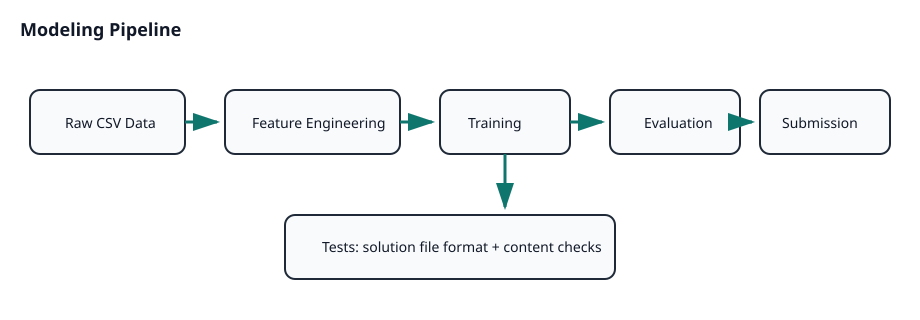

# Kaggle Titanic

[](https://github.com/njoppi2/kaggle-titanic/actions/workflows/ci.yml)
[](LICENSE)
[](https://github.com/njoppi2/kaggle-titanic/commits/main)

End-to-end ML competition project for Kaggle Titanic survival prediction from tabular passenger data.

## Snapshot



## Problem

Given `train.csv` and `test.csv`, predict `Survived` for unseen passengers while maintaining transparent preprocessing and a reproducible submission workflow.

## Tech Stack

- Python (notebook and script workflows)
- Jupyter Notebook
- XGBoost / classical ML preprocessing
- GitHub Actions (validation checks)

## Repository Layout

- `data/`: competition train/test datasets
- `titanic_survival_NN.ipynb`: main notebook (EDA, preprocessing, modeling)
- `xgboost.py`: script-based model experimentation
- `solutions/`: generated submission files
- `tests/`: checks for generated output format/content

## Quickstart

```bash
python -m venv .venv
source .venv/bin/activate
pip install -r requirements.txt
```

Run notebook:

```bash
jupyter notebook titanic_survival_NN.ipynb
```

Or run script experiment:

```bash
python xgboost.py
```

## Reproducible CLI Baseline

Generate a deterministic baseline submission and CV report without opening notebooks:

```bash
python scripts/reproducible_baseline.py
```

Outputs:

- `solutions/cli_baseline_submission.csv`
- `artifacts/cv_report.json`

## Validation and CI

Local check:

```bash
python scripts/reproducible_baseline.py
python -m unittest discover -s tests -p "test_*.py"
```

CI (`.github/workflows/ci.yml`) validates Python syntax for `xgboost.py` and solution-file tests.

## Results

- Best score in this repository: **0.78229** (Kaggle public leaderboard).
- Includes notebook-first and script-based experimentation paths.
- Includes automated checks for generated submission files.

## Limitations

- Workflow is still notebook-centered for main reproducibility path.
- Hyperparameter search and CV reporting are limited.
- No single CLI command yet to reproduce final submission end-to-end.

## Roadmap

- Add reproducible CLI pipeline for submission generation.
- Add cross-validation report and feature-importance artifacts.
- Add pinned environment lockfile for stronger reproducibility.

## Contributing

See [CONTRIBUTING.md](CONTRIBUTING.md).
